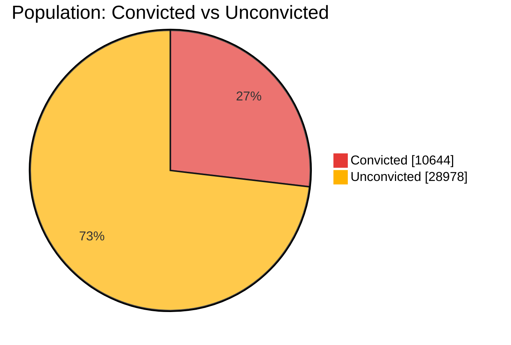
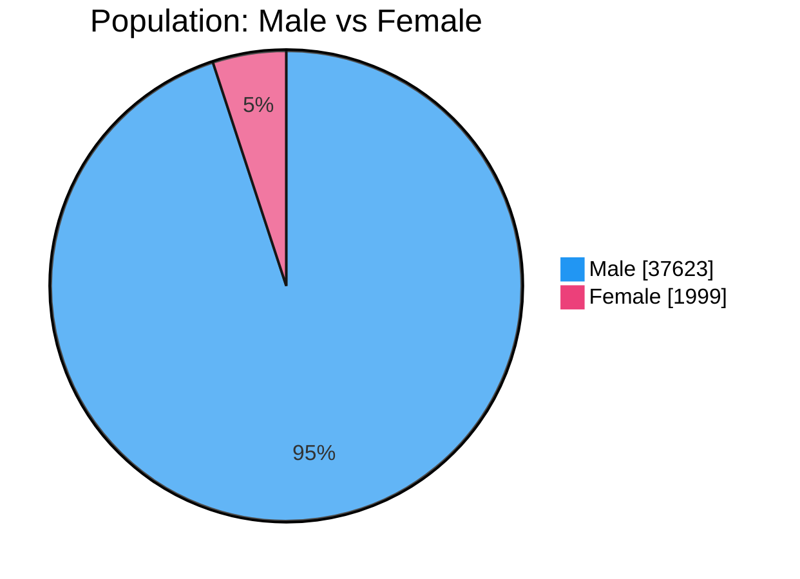
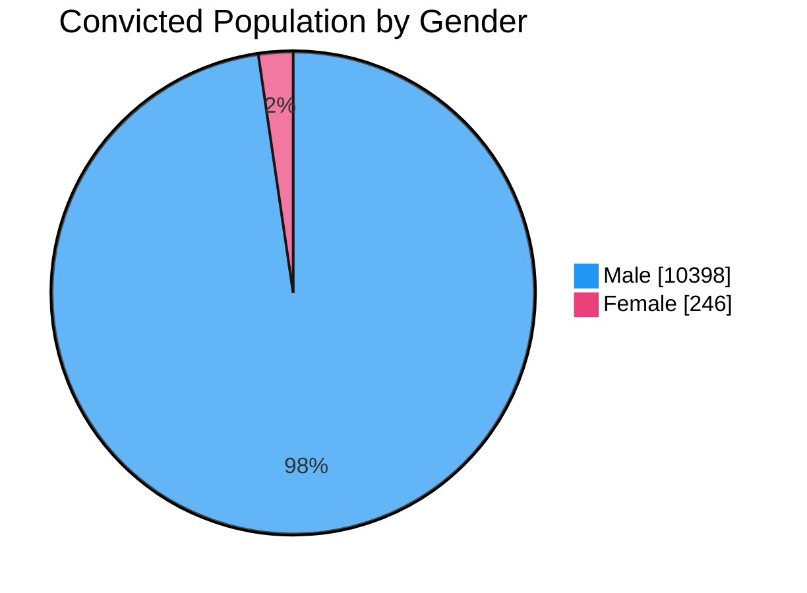
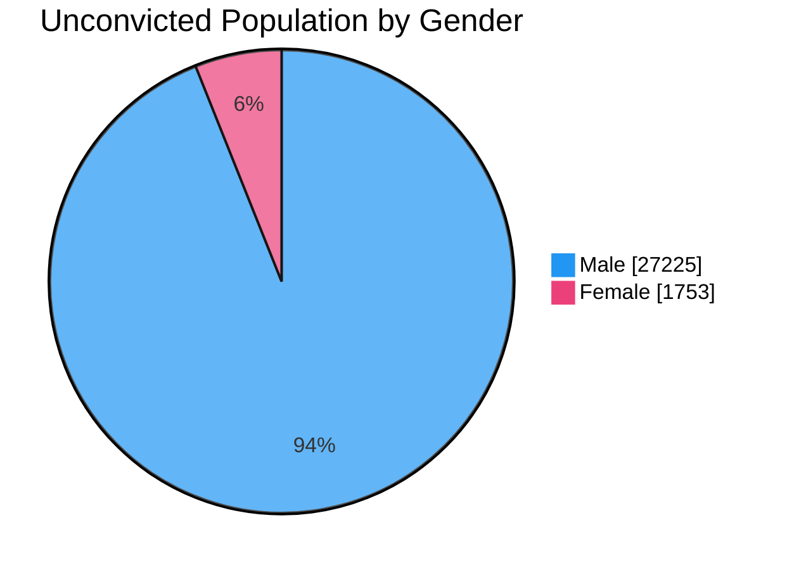
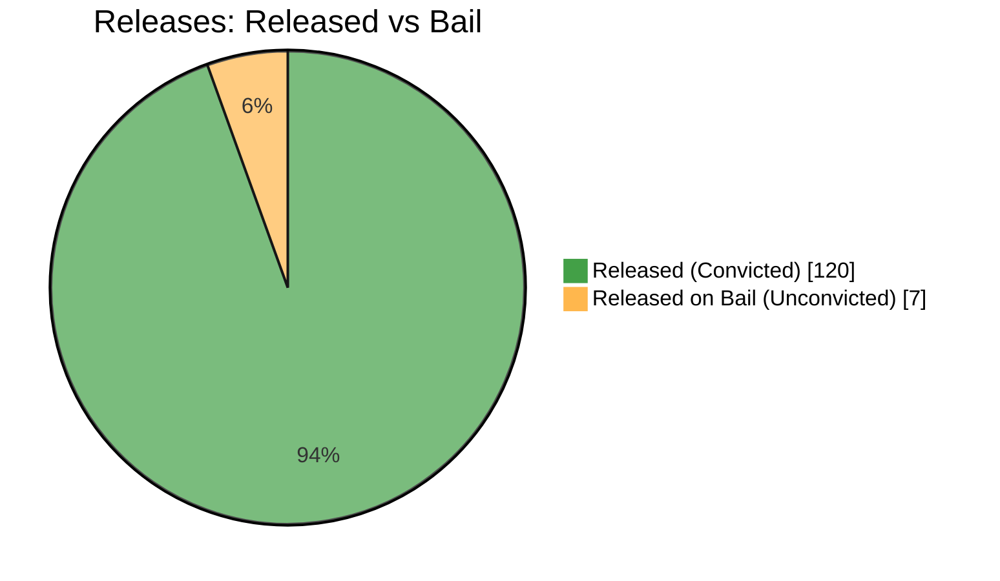
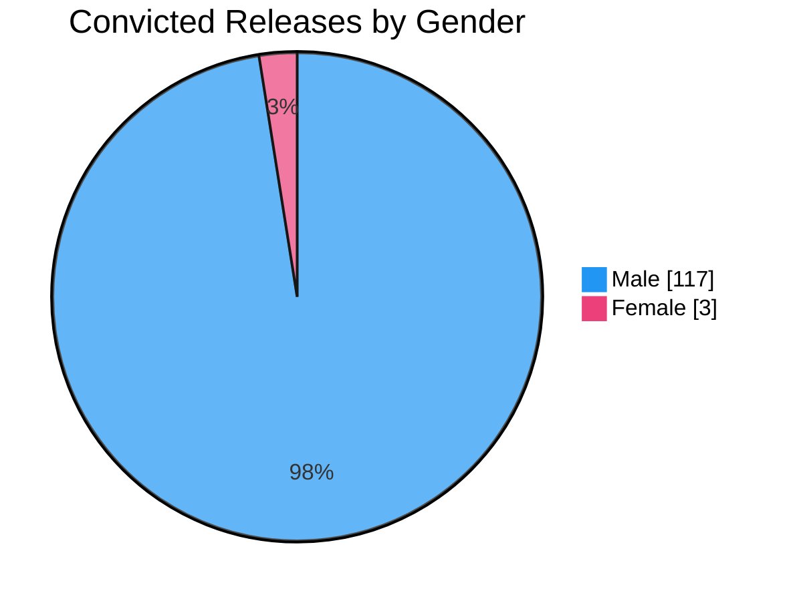
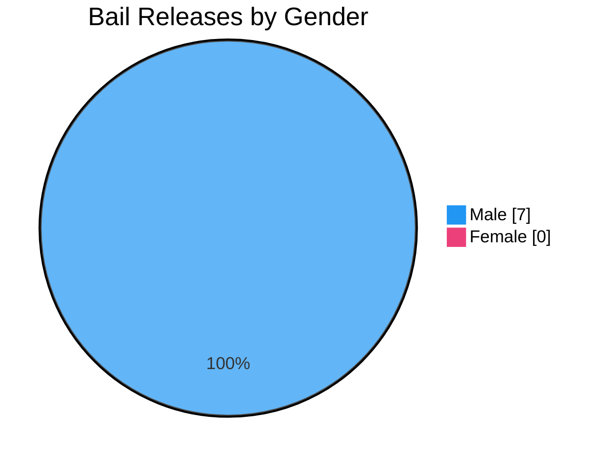

# lk_prisons


Daily statistical snapshots of Sri Lankan prisons.

## Source

Data is scraped from the daily snapshot published by the Sri Lanka Department of Prisons at [http://prisons.gov.lk/web/en/statistics-information-en/](http://prisons.gov.lk/web/en/statistics-information-en/). The snapshot is embedded on that page as a published Google Slides presentation.

## Latest Data (2026-07-19)

```json
{
  "date_str": "2026-07-19",
  "convicted_male": 10398,
  "convicted_female": 246,
  "convicted_total": 10644,
  "unconvicted_male": 27225,
  "unconvicted_female": 1753,
  "unconvicted_total": 28978,
  "total_male": 37623,
  "total_female": 1999,
  "total_total": 39622,
  "convicted_release_male": 117,
  "convicted_release_female": 3,
  "convicted_release_total": 120,
  "unconvicted_release_on_bail_male": 7,
  "unconvicted_release_on_bail_female": 0,
  "unconvicted_release_on_bail_total": 7
}
```

## Charts

All charts below describe the prison population and releases recorded on **2026-07-19**.

### Population: Convicted vs Unconvicted

How the total prison population splits between people already **convicted** of a crime and those **unconvicted** (remand prisoners awaiting trial or sentencing).



### Population: Male vs Female

The gender split across the entire prison population (convicted and unconvicted combined).



### Convicted Population by Gender

The gender split among **convicted** prisoners only.



### Unconvicted Population by Gender

The gender split among **unconvicted** (remand) prisoners only.



### Releases: Released vs Bail

Of the prisoners leaving custody on this day, how many were **released** after serving as convicted prisoners versus **released on bail** while still unconvicted.



### Convicted Releases by Gender

The gender split among convicted prisoners **released** on this day.



### Bail Releases by Gender

The gender split among unconvicted prisoners **released on bail** on this day.



## History

- [2026-07-19](data/2026-07-19)
- [2026-07-17](data/2026-07-17)
- [2026-07-16](data/2026-07-16)
- [2026-07-15](data/2026-07-15)
- [2026-07-14](data/2026-07-14)
- [2026-07-13](data/2026-07-13)
- [2026-07-11](data/2026-07-11)
- [2026-07-10](data/2026-07-10)
- [2026-07-08](data/2026-07-08)


[](https://opensource.org/licenses/MIT)
