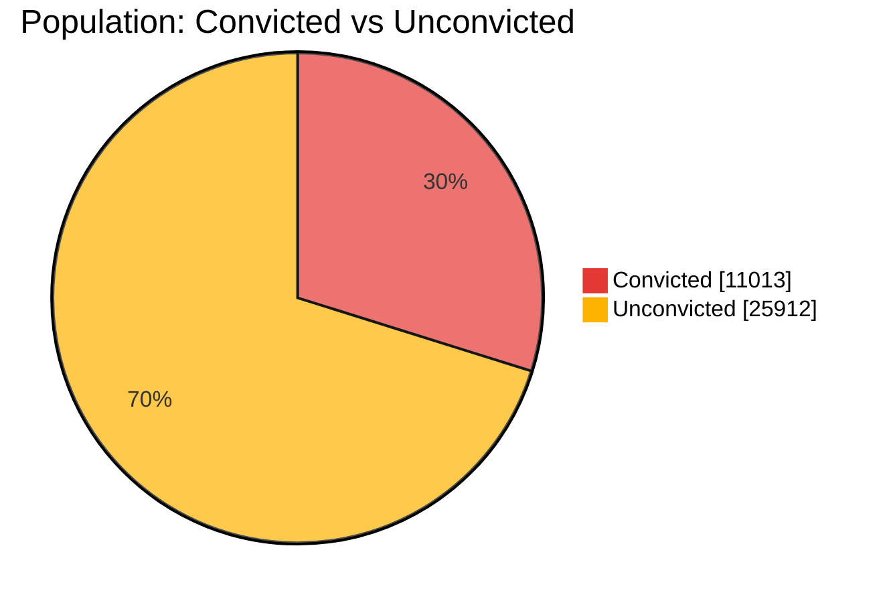
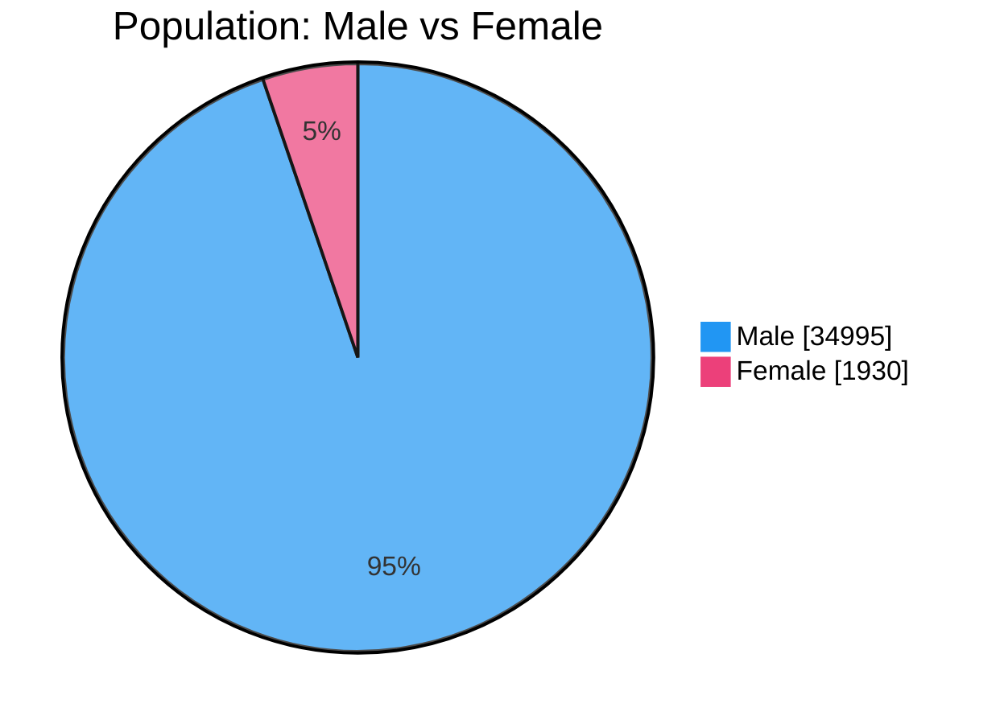
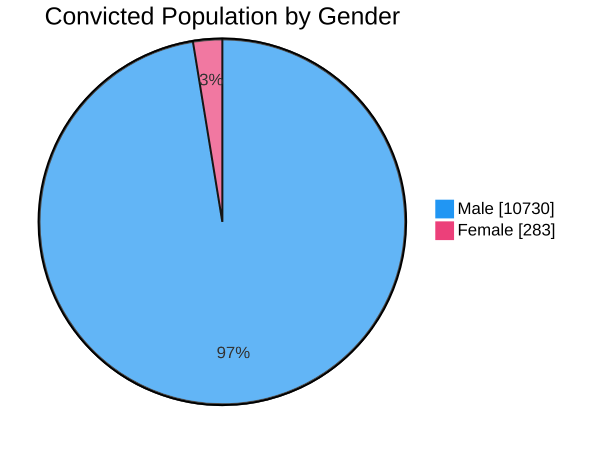
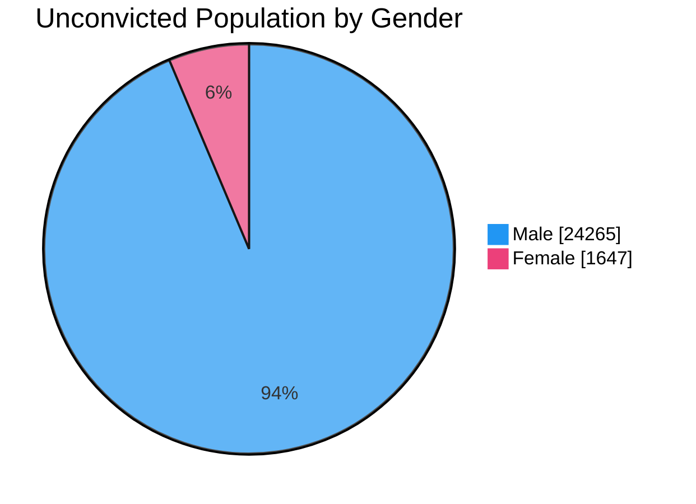
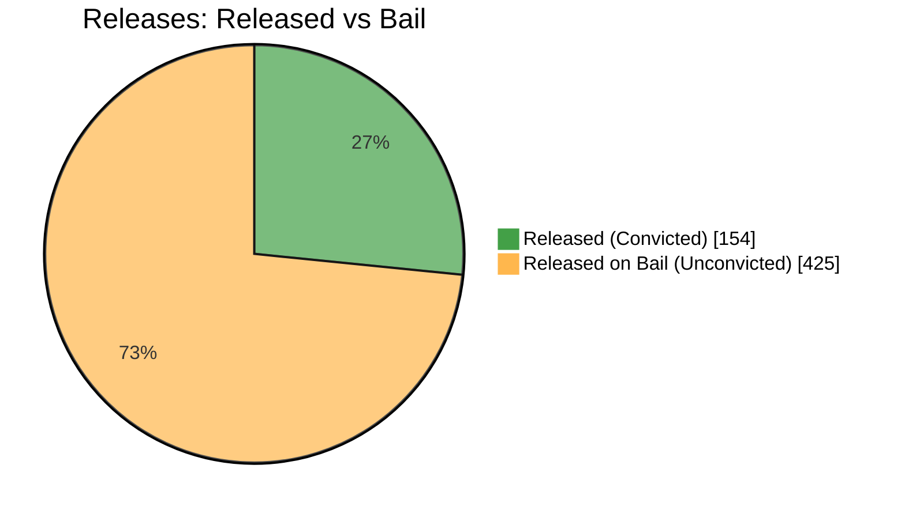
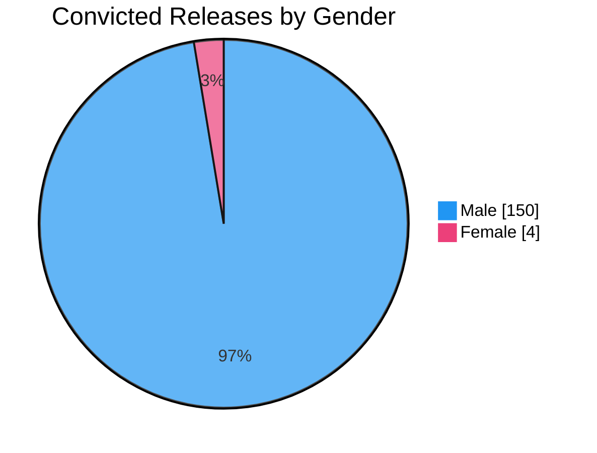
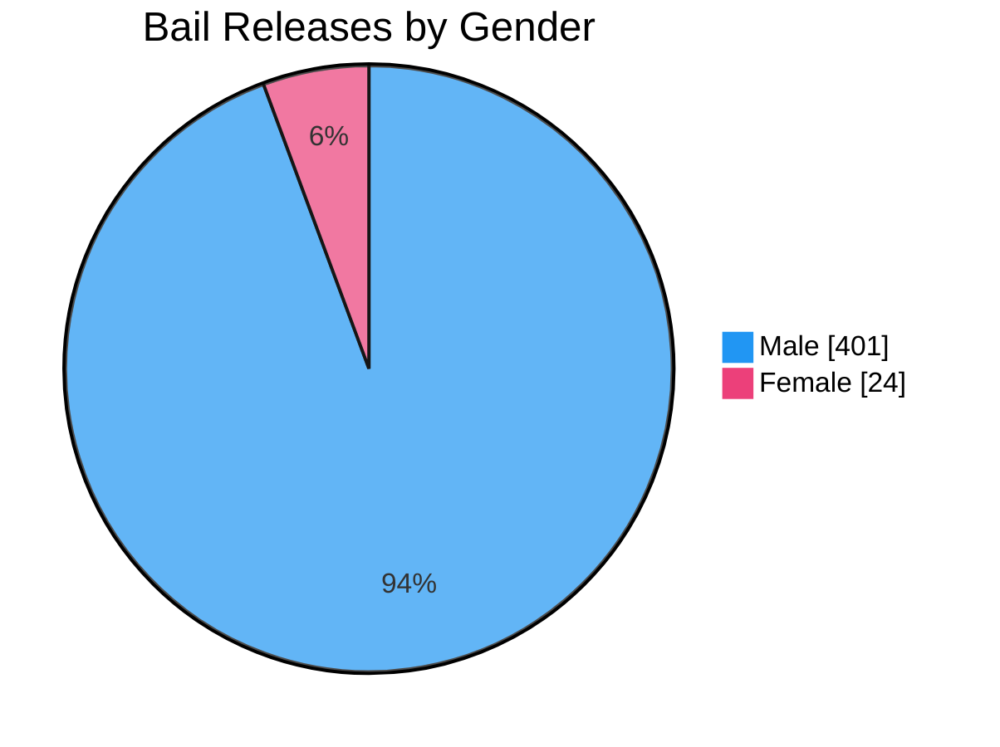

# lk_prisons


Daily statistical snapshots of Sri Lankan prisons.

## Source

Data is scraped from the daily snapshot published by the Sri Lanka Department of Prisons at [http://prisons.gov.lk/web/en/statistics-information-en/](http://prisons.gov.lk/web/en/statistics-information-en/). The snapshot is embedded on that page as a published Google Slides presentation.

## Latest Data (2026-09-30)

```json
{
  "date_str": "2026-09-30",
  "convicted_male": 10730,
  "convicted_female": 283,
  "convicted_total": 11013,
  "unconvicted_male": 24265,
  "unconvicted_female": 1647,
  "unconvicted_total": 25912,
  "total_male": 34995,
  "total_female": 1930,
  "total_total": 36925,
  "convicted_release_male": 150,
  "convicted_release_female": 4,
  "convicted_release_total": 154,
  "unconvicted_release_on_bail_male": 401,
  "unconvicted_release_on_bail_female": 24,
  "unconvicted_release_on_bail_total": 425
}
```

## Charts

All charts below describe the prison population and releases recorded on **2026-09-30**.

### Population: Convicted vs Unconvicted

How the total prison population splits between people already **convicted** of a crime and those **unconvicted** (remand prisoners awaiting trial or sentencing).


```mermaid
%%{init: {'themeVariables': {'pie1': '#E53935', 'pie2': '#FFB300'}}}%%
pie showData title Population: Convicted vs Unconvicted
    "Convicted" : 11013
    "Unconvicted" : 25912
```

### Population: Male vs Female

The gender split across the entire prison population (convicted and unconvicted combined).


```mermaid
%%{init: {'themeVariables': {'pie1': '#2196F3', 'pie2': '#EC407A'}}}%%
pie showData title Population: Male vs Female
    "Male" : 34995
    "Female" : 1930
```

### Convicted Population by Gender

The gender split among **convicted** prisoners only.


```mermaid
%%{init: {'themeVariables': {'pie1': '#2196F3', 'pie2': '#EC407A'}}}%%
pie showData title Convicted Population by Gender
    "Male" : 10730
    "Female" : 283
```

### Unconvicted Population by Gender

The gender split among **unconvicted** (remand) prisoners only.


```mermaid
%%{init: {'themeVariables': {'pie1': '#2196F3', 'pie2': '#EC407A'}}}%%
pie showData title Unconvicted Population by Gender
    "Male" : 24265
    "Female" : 1647
```

### Releases: Released vs Bail

Of the prisoners leaving custody on this day, how many were **released** after serving as convicted prisoners versus **released on bail** while still unconvicted.


```mermaid
%%{init: {'themeVariables': {'pie1': '#43A047', 'pie2': '#FFB74D'}}}%%
pie showData title Releases: Released vs Bail
    "Released (Convicted)" : 154
    "Released on Bail (Unconvicted)" : 425
```

### Convicted Releases by Gender

The gender split among convicted prisoners **released** on this day.


```mermaid
%%{init: {'themeVariables': {'pie1': '#2196F3', 'pie2': '#EC407A'}}}%%
pie showData title Convicted Releases by Gender
    "Male" : 150
    "Female" : 4
```

### Bail Releases by Gender

The gender split among unconvicted prisoners **released on bail** on this day.


```mermaid
%%{init: {'themeVariables': {'pie1': '#2196F3', 'pie2': '#EC407A'}}}%%
pie showData title Bail Releases by Gender
    "Male" : 401
    "Female" : 24
```

## History

- [2026-09-30](data/2026-09-30)
- [2026-09-29](data/2026-09-29)
- [2026-09-28](data/2026-09-28)
- [2026-09-26](data/2026-09-26)
- [2026-09-25](data/2026-09-25)
- [2026-09-24](data/2026-09-24)
- [2026-09-20](data/2026-09-20)
- [2026-09-17](data/2026-09-17)
- [2026-09-15](data/2026-09-15)
- [2026-09-14](data/2026-09-14)
- [2026-09-09](data/2026-09-09)
- [2026-09-08](data/2026-09-08)
- [2026-09-07](data/2026-09-07)
- [2026-09-06](data/2026-09-06)
- [2026-09-04](data/2026-09-04)
- [2026-09-03](data/2026-09-03)
- [2026-09-01](data/2026-09-01)
- [2026-08-31](data/2026-08-31)
- [2026-08-30](data/2026-08-30)
- [2026-08-29](data/2026-08-29)
- [2026-08-27](data/2026-08-27)
- [2026-08-25](data/2026-08-25)
- [2026-08-24](data/2026-08-24)
- [2026-08-23](data/2026-08-23)
- [2026-08-21](data/2026-08-21)
- [2026-08-20](data/2026-08-20)
- [2026-08-19](data/2026-08-19)
- [2026-08-18](data/2026-08-18)
- [2026-08-17](data/2026-08-17)
- [2026-08-16](data/2026-08-16)
- [2026-08-14](data/2026-08-14)
- [2026-08-13](data/2026-08-13)
- [2026-08-12](data/2026-08-12)
- [2026-08-09](data/2026-08-09)
- [2026-08-05](data/2026-08-05)
- [2026-08-03](data/2026-08-03)
- [2026-08-01](data/2026-08-01)
- [2026-07-31](data/2026-07-31)
- [2026-07-30](data/2026-07-30)
- [2026-07-24](data/2026-07-24)
- [2026-07-23](data/2026-07-23)
- [2026-07-21](data/2026-07-21)
- [2026-07-20](data/2026-07-20)
- [2026-07-19](data/2026-07-19)
- [2026-07-17](data/2026-07-17)
- [2026-07-16](data/2026-07-16)
- [2026-07-15](data/2026-07-15)
- [2026-07-14](data/2026-07-14)
- [2026-07-13](data/2026-07-13)
- [2026-07-11](data/2026-07-11)
- [2026-07-10](data/2026-07-10)
- [2026-07-08](data/2026-07-08)


[](https://opensource.org/licenses/MIT)
